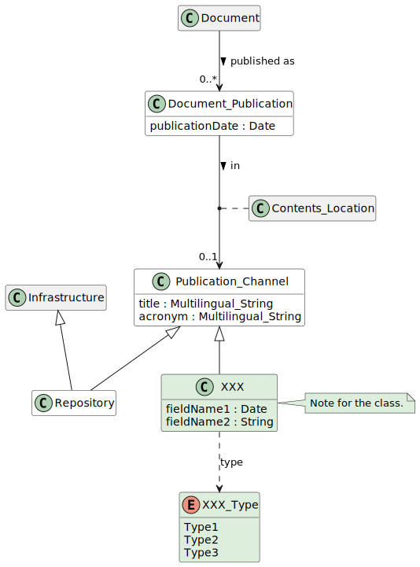
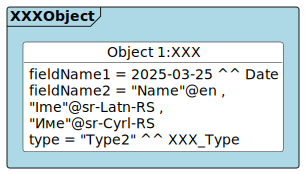

# CERIF XXX Module
Basic domain description of the module

## Status
(2026-03-05) Experimental.

## Overview

## Listings

### Entities
The XXX Module consists of the following entities:
* [XXX entity](./entities/XXX.md) 

### Data Types
* [XXX data type](./datatypes/XXX.md)
* [YYY data type](./datatypes/YYY.md)

## Illustrative Diagrams

## Usage note
This module cannot be used without the core.
The module includes the following examples:
* [XXX example](./examples/README.md#xxx-example)
* ...

## Development

This module relies on the [CERIF-Core](https://github.com/EuroCRIS/CERIF-Core): we include some shared [entities](https://github.com/EuroCRIS/CERIF-Core/tree/main/entities) and [datatypes](https://github.com/EuroCRIS/CERIF-Core/tree/main/datatypes) from it and we also re-use the [building environment](https://github.com/EuroCRIS/CERIF-Core/tree/main/tools) for the diagrams. This module is developed in line with the [guidelines](https://github.com/EuroCRIS/CERIF-Core/tree/main/guidelines).
